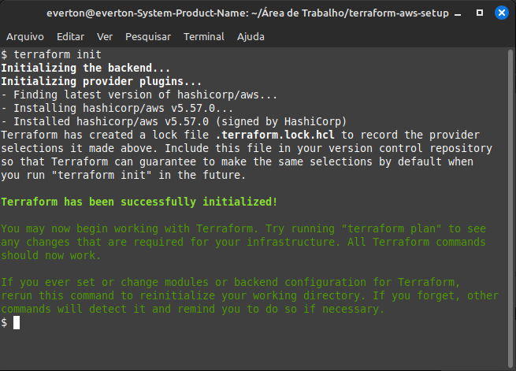
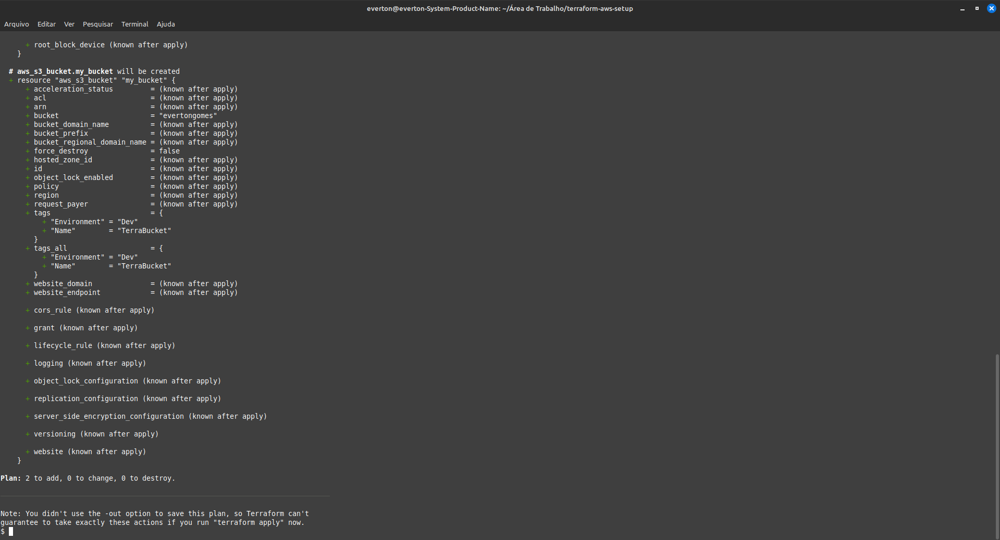
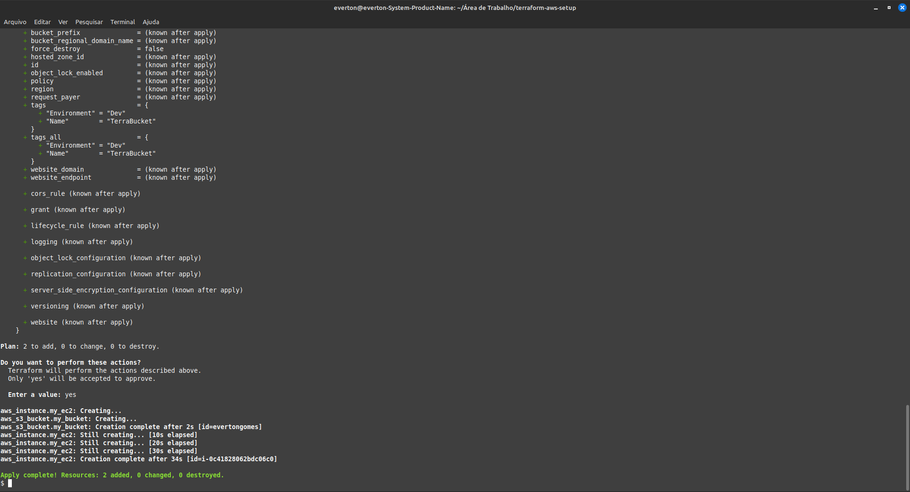
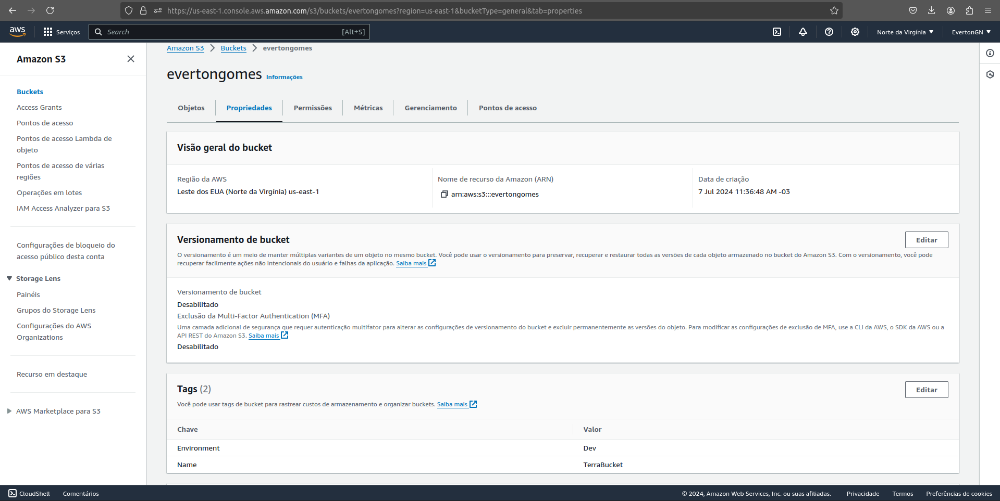

# Antonio Everton Gomes Do Nascimento

## hands-on
configurar um arquivo .tf (Terraform script) e provisionar uma instância EC2 e um bucket S3 utilizando o plano gratuito (freetier) da AWS.

## Prints

### init, plan e apply

### ec2

### s3
